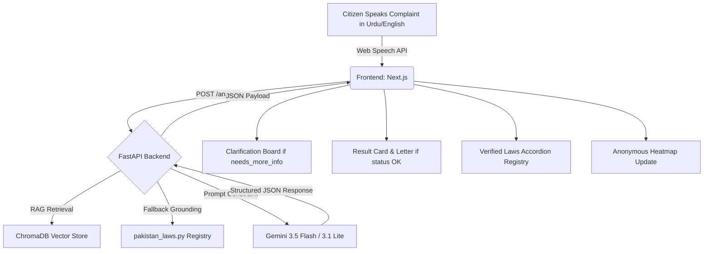

<div align="center">
  
  <h1 align="center">HaqDar AI — حق دار</h1>
  <p align="center">
    <strong>Pakistan's first voice-enabled AI legal rights assistant.</strong>
    <br />
    <em>اپنی شکایت درج کریں — اپنے حقوق جانیں</em>
  </p>
  <p align="center">
    
    
    
    
    
  </p>
</div>

---

## 🌟 What is HaqDar?

In Pakistan, the greatest weapon of institutional corruption is the silence of the ordinary citizen — forced by a system made complex and intimidating by design. **HaqDar AI** breaks that silence.

HaqDar is a voice-first web application that turns an unstructured Urdu/English complaint into structured civic intelligence. Citizens can simply speak or type their issue in plain Urdu, English, or regional languages. In seconds, HaqDar identifies the violated Pakistani law, names the responsible authority, generates a formal legal complaint letter, and plots the report anonymously on a live corruption heatmap.

Designed with a premium **Rich Mahogany Wood Console & Textured Aged Parchment Sheet** aesthetic, the application provides an official, immersive, and trustworthy space for legal aid.

*Built for the **Code for Pakistan: AI for Civic Innovation Hackathon 2026**.*

## 🚀 Features

- 🎙️ **Voice-First Input (Urdu & English)**: Speak your complaint directly using the Web Speech API (`ur-PK` and `en-US` locales) with automated language script auto-detection.
- ✍️ **Regional Typing Support**: Allows typing in Arabic or Latin/Roman scripts for **Punjabi**, **Sindhi**, and **Pashto** (voice-to-text for regional languages is on the future roadmap).
- ⏳ **Bilingual Animated Step Loader**: A gorgeous double-spinning medallion loader that provides step-by-step progress feedback (analyzing, searching law registry, RAG analysis, drafting petition).
- ⚖️ **Verified Law Registry Accordion**: Renders actual statutory law records from the RAG context, showing the official Law Title, the exact provision text, responsible enforcement authorities, and contact helplines/websites.
- 💬 **Interactive Clarification Board**: Handles brief complaints (`needs_more_info` status) gracefully by prompting users with AI-generated questions to capture necessary context instead of failing.
- 📄 **Formal Letter Generation & Download**: Generates formal petition documents, supports inline editing, and downloads formatted PDFs (or text fallback files).
- 🗺️ **Civic Pulse Heatmap & Dashboard**: Interactive React-Leaflet GeoJSON heatmap plotting anonymous complaints, alongside Recharts district rankings, category breakdowns, and monthly trends.
- 🛡️ **Confidence Scoring & Metadata Verification**: Displays trust scoring and backend meta tags (Database version, Last legal review date, Gemini model tier, latency, and cache status).

## 🛠️ Tech Stack

| Component | Technology | Description |
|-----------|------------|-------------|
| **Frontend** | Next.js 16 (App Router) | React framework for server-side rendering and routing. |
| **Styling** | Tailwind CSS v4.0 | Premium Mahogany Wood and Aged Parchment design tokens. |
| **Components**| shadcn/ui | Accessible, unstyled React primitives. |
| **Maps** | React-Leaflet | Interactive GeoJSON-powered map of Pakistan. |
| **Charts** | Recharts | Composable charting library for the Civic Pulse dashboard. |
| **Animations**| Framer Motion | Smooth viewport-triggered micro-interactions. |
| **Backend** | FastAPI (Python) | High-performance API server with ChromaDB RAG. |

## 🏗️ Architecture Flow



## 🌍 SDG Alignment

HaqDar directly addresses two critical United Nations Sustainable Development Goals:
- **SDG 16 (Peace, Justice, and Strong Institutions)**: Promoting the rule of law at the national level and ensuring equal access to justice for all.
- **SDG 10 (Reduced Inequalities)**: Empowering marginalized communities by removing the literacy and financial barriers to legal aid.

## 💻 Getting Started (Local Development)

1. **Clone the repository**
   ```bash
   git clone https://github.com/waybig125/haqdar-ai.git
   cd haqdar-ai
   ```

2. **Install dependencies**
   ```bash
   npm install
   ```

3. **Configure Environment Variables**
   Create a `.env` file in the root directory:
   ```env
   NEXT_PUBLIC_API_URL=https://haqdar-ai.onrender.com
   ```

4. **Run the development server**
   ```bash
   npm run dev
   ```
   Open [http://localhost:3000](http://localhost:3000) in your browser.

## 📂 Project Structure

```text
src/
├── app/                  # Next.js App Router (Pages & Layouts)
│   ├── dashboard/        # Civic Pulse Dashboard route
│   ├── layout.js         # Root layout with RTL Urdu configuration
│   └── page.js           # Main complaint flow (conditional result boards)
|── components/
│   ├── features/         # Core HaqDar logic (ComplaintInput, ResultCard, CivicPulse)
│   ├── layout/           # Header, Footer
│   ├── sections/         # HeroSection, SdgFocusSection
│   └── ui/               # Reusable shadcn/ui and Animated components
├── lib/                  
│   ├── api.js            # Centralized API fetch client with normalizers
│   ├── hooks.js          # Web Speech API & Fetch hooks
│   └── utils.js          # Tailwind class merger utilities
└── styles/
    └── globals.css       # Custom design styles (.wood-console, .parchment-sheet)
```

## 🛣️ Roadmap

- [x] **Phase 1**: Voice-first Multilingual Web App MVP
- [x] **Phase 2**: Verified Law Registry entries & Metadata footers
- [x] **Phase 3**: Smart Interactive Clarification Boards (`needs_more_info`)
- [ ] **Phase 4**: WhatsApp Bot integration (zero app download required)
- [ ] **Phase 5**: Direct Ombudsman email routing

## 👥 Team

- **Areeba Khan** - AI & Backend Architecture
- **Muhammad Areeb** - Frontend Engineering & UI/UX

---
*MIT License © 2026 HaqDar AI*
