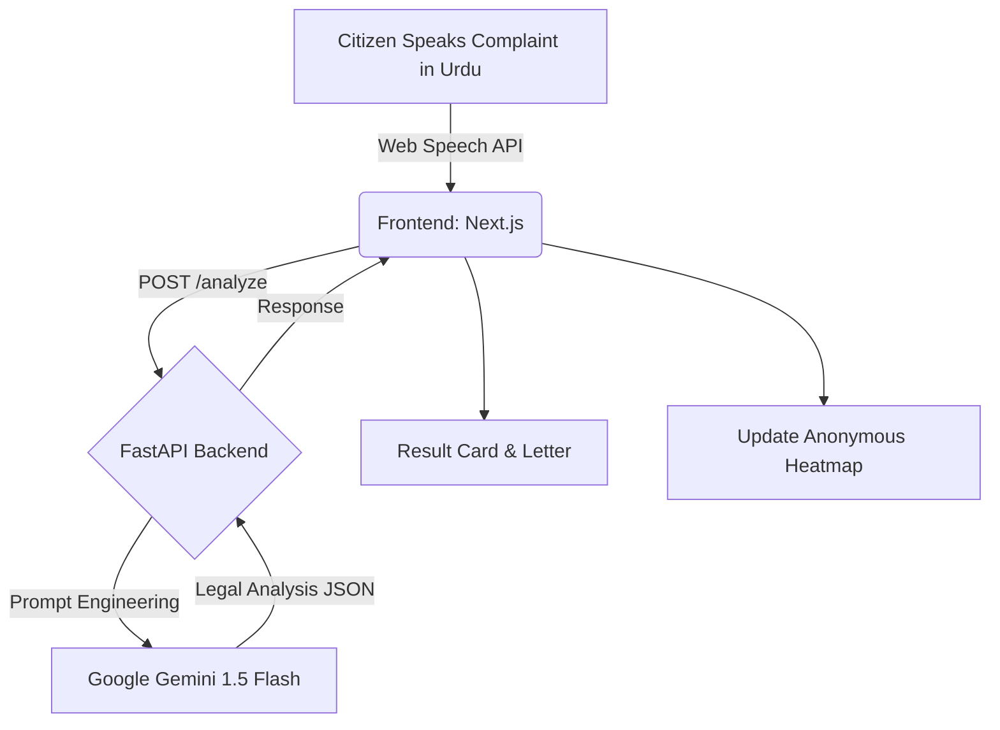

<div align="center">
  
  <h1 align="center">HaqDar AI — حق دار</h1>
  <p align="center">
    <strong>Pakistan's first voice-enabled AI legal rights assistant.</strong>
    <br />
    <em>اپنی شکایت درج کریں — اپنے حقوق جانیں</em>
  </p>
  <p align="center">
    
    
    
    
    
  </p>
</div>

---

## 🌟 What is HaqDar?

In Pakistan, the greatest weapon of institutional corruption is the silence of the ordinary citizen — forced by a system made complex and intimidating by design. **HaqDar AI** breaks that silence.

HaqDar is a web-based platform that turns an unstructured Urdu complaint into structured civic intelligence. Citizens can simply speak or type their issue in plain Urdu. In under 5 seconds, HaqDar identifies the violated Pakistani law, names the responsible authority, generates a formal legal complaint letter, and plots the report anonymously on a live corruption heatmap.

*Built for the **Code for Pakistan: AI for Civic Innovation Hackathon 2026**.*

## 🚀 Features

- 🎙️ **Voice First (Urdu)**: Speak your complaint directly using the Web Speech API (`ur-PK` locale). No typing required.
- ⚖️ **Instant Legal Analysis**: Powered by Google Gemini 1.5 Flash, pre-prompted with Pakistani laws (Police Rules, Consumer Protection, Labour Laws).
- 📝 **Formal Letter Generation**: Instantly creates a ready-to-print, formally formatted complaint letter in legal Urdu.
- 🛡️ **Know Your Rights**: An educational mode explaining the citizen's rights, required evidence, and next steps in simple terms.
- 🗺️ **Civic Pulse Heatmap**: A live, anonymous React-Leaflet heatmap visualizing corruption hotspots across Pakistan.
- 📊 **Open Data Dashboard**: District-wise rankings, 6-month trends, and category breakdowns.

## 🛠️ Tech Stack

| Component | Technology | Description |
|-----------|------------|-------------|
| **Frontend** | Next.js 16 (App Router) | React framework for server-side rendering and routing. |
| **Styling** | Tailwind CSS v4.3 | CSS-first configuration with a custom "Civic Emerald" theme. |
| **Components**| shadcn/ui | Accessible, unstyled React primitives. |
| **Maps** | React-Leaflet | Interactive GeoJSON-powered map of Pakistan. |
| **Charts** | Recharts | Composable charting library for the Civic Pulse dashboard. |
| **Animations**| Framer Motion | Smooth viewport-triggered micro-interactions. |
| **Backend** | FastAPI (Python) | High-performance API server (developed separately). |

## 🏗️ Architecture Flow



## 🌍 SDG Alignment

HaqDar directly addresses two critical United Nations Sustainable Development Goals:
- **SDG 16 (Peace, Justice, and Strong Institutions)**: Promoting the rule of law at the national level and ensuring equal access to justice for all.
- **SDG 10 (Reduced Inequalities)**: Empowering marginalized communities by removing the literacy and financial barriers to legal aid.

## 💻 Getting Started (Local Development)

1. **Clone the repository**
   ```bash
   git clone https://github.com/waybig125/haqdar-ai.git
   cd haqdar-ai
   ```

2. **Install dependencies**
   ```bash
   npm install
   ```

3. **Configure Environment Variables**
   Create a `.env.local` file in the root directory:
   ```env
   # Point this to your local FastAPI instance
   NEXT_PUBLIC_API_URL=http://localhost:8000
   ```

4. **Run the development server**
   ```bash
   npm run dev
   ```
   Open [http://localhost:3000](http://localhost:3000) in your browser.

## 📂 Project Structure

```text
src/
├── app/                  # Next.js App Router (Pages & Layouts)
│   ├── dashboard/        # Civic Pulse Dashboard route
│   ├── layout.js         # Root layout with RTL Urdu configuration
│   └── page.js           # Main complaint flow
├── components/           
│   ├── features/         # Core HaqDar logic (ComplaintInput, ResultCard)
│   ├── layout/           # Header, Footer
│   ├── sections/         # HeroSection
│   └── ui/               # Reusable shadcn/ui and Animated components
├── lib/                  
│   ├── api.js            # Centralized fetch client with mock fallbacks
│   ├── hooks.js          # Web Speech API & Fetch hooks
│   ├── theme.js          # JS-side color variables
│   └── types.js          # JSDoc type definitions
└── styles/
    └── globals.scss      # Tailwind v4 @theme and Civic Emerald palette
```

## 🛣️ Roadmap

- [x] **Phase 1**: Web App MVP (Hackathon scope)
- [ ] **Phase 2**: WhatsApp Bot integration (zero app download required)
- [ ] **Phase 3**: Direct Ombudsman email routing
- [ ] **Phase 4**: Open Data CSV exports for journalists

## 👥 Team

- **Areeba Khan** - AI & Backend Architecture
- **Muhammad Areeb** - Frontend Engineering & UI/UX

---
*MIT License © 2026 HaqDar AI*
